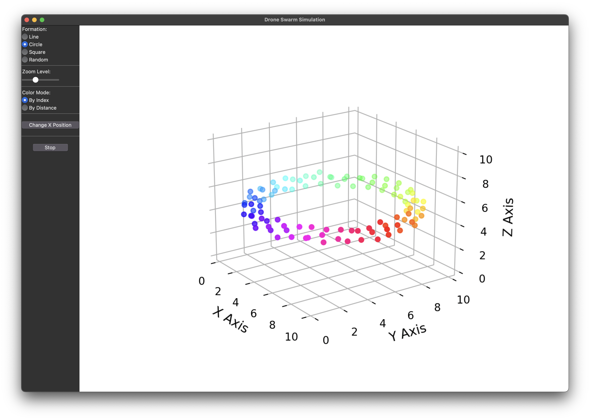

# Drone Swarm Simulation

> Work in Progress (WIP): Migration to asyncio on tkinter with event-driven processing.

A Python-based **drone swarm simulator** that models the behavior of multiple autonomous drones using different algorithms for **consensus**, **collision avoidance**, and **formation control**. The simulation is visualized in **3D** using Matplotlib and controlled through a Tkinter-based GUI.

[](https://www.youtube.com/watch?v=5PN6R7qeXt8)

## 🚀 Features

- **Swarm Behavior Algorithms:**
  - **Consensus Algorithm:** Ensures cohesion by moving drones toward the average position of their neighbors.
  - **Collision Avoidance Algorithm:** Prevents drones from colliding by adjusting their trajectories dynamically.
  - **Formation Control Algorithm:** Organizes drones into structured formations (line, circle, square or random).
- **Interactive Visualization:**
  - Real-time 3D visualization of drone movements using **Matplotlib**.
  - Adjustable **zoom level** for better observation.
  - Supports **different formations** dynamically via the GUI.
- **Multi-threaded Simulation:** The swarm behavior runs in a separate thread to keep the UI responsive.

## 🛠️ Installation

### Prerequisites

- **Python 3.12+** is required (and should include Tkinter).
- **Poetry** for dependency management.
- **Conda** for managing virtual environments (or **other** tools).

### Create and Activate your Virtual Environment

If you use Conda like I do:

#### Create a Conda environment with Python 3.12:

```bash
conda create -n drone-swarms python=3.12 -y
conda activate drone-swarms
```

### Install Poetry (if not installed)

```bash
pip install poetry
```

### Install Dependencies

Clone the repository and install dependencies using **Poetry**:

```bash
git clone https://github.com/jeanjerome/drone-swarms.git
cd drone-swarms
poetry install
```

## ▶️ Usage

Run the main script using Poetry:

```bash
poetry run python main.py
```

### UI Controls
- **Formation Selection:** Choose between line, circle, square and random formations.
- **Zoom Level:** Adjust zoom for better visualization (but no longer needed due to automatic zooming).
- **Start/Stop Simulation:** Toggle the simulation on and off.
- **Color Mode:** Choose drones color based on their index or distance to target.

## 📂 Project Structure

```
drone-swarm-simulation/
│
├── main.py                   # Main entry point to launch the simulation. Defines the DroneSwarmApp class.
│
├── ai/                       # Directory containing behavior algorithms
│   ├── behavior_algorithm.py # Base class for behavior algorithms
│   ├── collision_avoidance.py # Collision avoidance algorithm
│   ├── consensus.py          # Consensus algorithm
│   ├── formation_control.py  # Formation control algorithm
│   └── behavior_manager.py   # Behavior manager
│
├── core/                     # Directory containing drone-related classes and modules
│   ├── drone.py              # Main class representing a drone
│   ├── motor.py              # Class representing the drone's motors
│   ├── battery.py            # Class managing the drone's battery level
│   └── communication.py      # Class managing communication between drones
│
├── simulation/              # Directory containing simulation classes
│   ├── swarm_simulation.py  # Main class for the drone swarm simulation
│   └── event_manager.py      # Class managing events and communication between components
│
├── visualization/           # Directory containing visualization classes
│   ├── color_manager.py     # Class managing drone colors
│   └── swarm_visualizer.py  # Main class for visualizing the drone swarm
│
├── config/                   # Directory containing configuration files
│   └── sim_config.py         # Global configuration for the simulation
│
├── tests/                    # Directory containing tests
│   ├── ai/                   # Tests for AI algorithms
│   │   ├── test_behavior_manager.py # Tests for the BehaviorManager class
│   │   ├── test_collision_avoidance.py # Tests for the CollisionAvoidance algorithm
│   │   ├── test_consensus.py # Tests for the Consensus algorithm
│   │   └── test_formation_control.py # Tests for the FormationControl algorithm
│   │
│   ├── core/                 # Tests for core components
│   │   ├── test_battery.py    # Tests for the Battery class
│   │   ├── test_communication.py # Tests for the Communication class
│   │   ├── test_drone.py     # Tests for the Drone class
│   │   └── test_motor.py     # Tests for the Motor class
│   │
│   ├── simulation/           # Tests for simulation components
│   │   ├── test_event_manager.py # Tests for the EventManager class
│   │   └── test_swarm_simulation.py # Tests for the SwarmSimulation class
│   │
│   └── visualization/        # Tests for visualization components
│       ├── test_color_manager.py # Tests for the ColorManager class
│       └── test_swarm_visualizer.py # Tests for the SwarmVisualizer class
│
├── README.md                 # Main README file
│
└── pyproject.toml            # Project dependencies manage by Poetry
```

## 🛠️ Customization

- **Change Number of Drones:** Modify `self.num_drones` in `main.py`.
- **Adjust Algorithm Parameters:** Modify `epsilon`, `collision_threshold`, or `formation_type` in `main.py`.

## 📖 Future Improvements

- 🔄 Add more **swarm behavior algorithms**:
  - [ ] **Obstacle Avoidance (Évitement d'Obstacles)**
   - **Description** : The drones detect and avoid static or dynamic obstacles in the environment.
   - **Implementation** : Introduce obstacles in the 3D space and apply a similar logic to collision avoidance to navigate around them.

  - [ ] **Path Planning (Planification de Trajectoire)**
     - **Description** : The drones plan and follow an optimal trajectory to reach a destination while avoiding obstacles.
     - **Implementation** : Use pathfinding algorithms like **A*** or **Dijkstra** to compute efficient routes in an environment with obstacles.

  - [ ] **Search and Rescue (Recherche et Sauvetage)**
     - **Description** : The drones explore an area to locate targets (e.g., distressed people) and coordinate their movements for efficient coverage.
     - **Implementation** : Implement **area coverage algorithms** and **collaborative search strategies**.

  - [ ] **Energy Management (Gestion de l'Énergie)**
     - **Description** : The drones manage their energy consumption to maximize flight time and prevent failures.
     - **Implementation** : Model energy consumption and adjust behaviors to save power (e.g., reducing speed or minimizing unnecessary movements).

  - [ ] **Communication Relay (Relais de Communication)**
     - **Description** : The drones act as relays to maintain communication between each other or with a base station, especially in environments where direct communication is limited.
     - **Implementation** : Model communication range and adjust drone positions dynamically to ensure network connectivity.

  - [ ] **Dynamic Task Allocation (Allocation Dynamique des Tâches)**
     - **Description** : The drones dynamically distribute tasks (e.g., surveillance, delivery) based on their capabilities and mission requirements.
     - **Implementation** : Use **optimization algorithms** for efficient task allocation in real-time scenarios.

  - [ ] **Flocking Behavior (Comportement de Vol en Essaim)**
     - **Description** : The drones follow swarm-inspired flight behaviors similar to birds or fish, incorporating alignment, cohesion, and separation.
     - **Implementation** : Implement **Reynolds' flocking rules** for realistic swarm movement.

- [ ] 🎮 Improve user interactivity in the **Tkinter GUI**.
- [ ]  📡 Introduce **real-world drone communication models**.

## 🤝 Contributing

Feel free to **fork**, **modify**, and **submit a pull request**! Suggestions and improvements are always welcome.  

## 📜 License

This project is licensed under the **MIT License**. See [LICENSE](LICENSE) for details.
